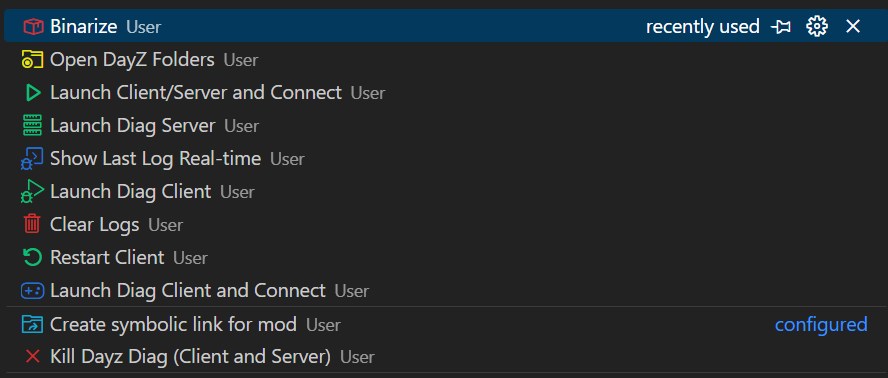

> [!NOTE]
> These customizations are made for my personal convenience, so all of this may not be interactively clear to you.

# VScode tasks for comformable modding in DayZ
### Features:
* Starting/stopping client and server.
* View real-time client/server logs in the VScode Powershell console.
* Automatic creation of symbolic links to mods.
* Automatic deletion of all client and server logs.
* Mod packaging.

## Setup
1. Copy `task.json`, `include.txt` and `include_sample.txt` to the following path: `%USERPROFILE%\AppData\Roaming\Code\User\`
2. Open settings.json (`Ctrl` + `Shift` + `P`) > `Open user settings (JSON)` insert these constants and customize the paths to your linking.
```json
"DAYZ_FOLDER": "D:\\Steam\\steamapps\\common\\DayZ",
"DAYZ_TOOLS_FOLDER": "D:\\Steam\\steamapps\\common\\DayZ Tools",
"DAYZ_DEFAULT_MODS": "D:\\Steam\\steamapps\\common\\DayZ\\!Workshop\\@CF;D:\\Steam\\steamapps\\common\\DayZ\\!Workshop\\@VPPAdminTools",
"CFG_PATH": "D:\\Steam\\steamapps\\common\\DayZServer\\serverDZ.cfg",
"SIGN_PATH": "D:\\Steam\\steamapps\\common\\DayZServer\\keys\\includelow.biprivatekey",
"MISSION_PATH": "D:\\Steam\\steamapps\\common\\DayZServer\\mpmissions\\dayzOffline.enoch",
```
3. Change the keyboard shortcuts in VSCode to start tasks for your convenience. In my case it is the `F1` key.

# Features description
### Open DayZ Folders
The list of folders is customized at the end of the `task.json` file > `inputs` > `id:folder`.

---

### Binarize

Uses Addon Builder to package the mod. If you need to package your mod completely, select `Full`. If you want the game to see the modification when using FilePatching, select `Sample`.

Additionally, customize the list of files to be packed. `include.txt` for full packing and `includeSample.txt` for modification template. By default there is `.csv`, because the game does not see it in the unpacked mod.
The mod is packaged under the path `${config:DAYZ_FOLDER}\\!Workshop\\@${workspaceFolderBasename}\\Addons`

---

### Create symbolic link for mod
> [!WARNING]
> VSCode must be run as administrator. 

Create link from the DayZ folder to the folder where your project is open in VScode.

---

### Clear Logs
Delete all `.log,` `.rpt` and `.mdmp` files from client or server profile folder.
> [!IMPORTANT]
> By default, the server profiles folder is located at the path `%LOCALAPPDATA%\DayZ Server`

---

### Show Last Log Real-time
Opens the last created `.log` file and updates it as new lines are added. Run this task only after 2-5 seconds since the DayZ process started.

---

### Launch Diag Client / Server etc.
No description is required. You can change the startup parameters as you wish.

The list of mods is taken from the `DAYZ_DEFAULT_MODS` constant + the open project from which you start the task.

## Example of use.

1. Open your project, e.g. from Workbench or P-Drive.
2. `F1` > `Binarize` > `Sample`
3. `F1` > `Create symbolic link for mod`
4. `F1` > `Launch Client/Server and Connect`

## Keybindings
Additionally, you can set keybindings in "keybindings.json".
```json
{
    "key": "ctrl+1",
    "command": "workbench.action.tasks.runTask",
    "args": "Launch Client/Server and Connect"
}
```
